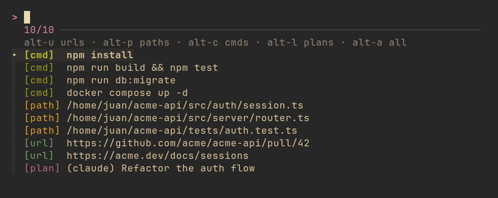
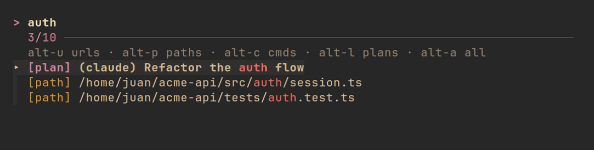
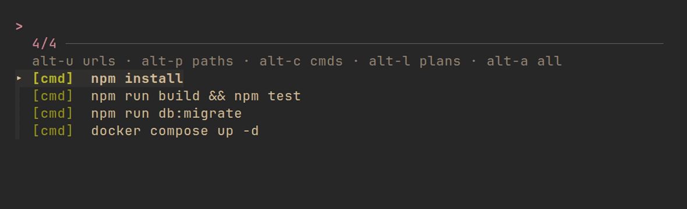

# trawl

Trawl the **urls, file paths, commands, and plans** out of your AI coding chats.
It reads your **Claude Code** and **Codex CLI** sessions and drops the good bits
into fzf. One key, fuzzy-pick, enter opens a url or copies a command, plan, or path.


---

## What it is

- A tiny CLI that reads your Claude Code and Codex session transcripts and drops
  the useful bits into fzf. No daemon, no config.
- **Commands** the agent gave you to run, lifted from its messages.
- **Plans** it proposed: Claude's plan-mode plan, Codex's `Plan` item.
- **Urls and paths** from across the chat.
- **Enter** opens a url; everything else copies. `ctrl-y` always copies.
- Scoped to the chat in the current directory. Any terminal, tmux or not.

## Two commands

One package, two binaries:

| | what it is | works *inside* a running chat? |
|---|---|---|
| **`trawl`** | the menu. Run it in a terminal, or bind a shell / tmux key to it. | only via tmux (below) |
| **`trawl-global`** | an OS-level launcher. Bind one key; it pops the menu over **any** app, even a running Codex/Claude TUI. | **yes** |

Use `trawl` day to day; reach for `trawl-global` when you want the global hotkey.

## Requirements

- **[fzf](https://github.com/junegunn/fzf)** for the menu UI. Required, on PATH.
- **Node 18+**.

## Install

```bash
npm install -g B33pBeeps/trawl     # installs both `trawl` and `trawl-global`
```

## Launch it

Three ways to fire trawl. They differ in **whether they work while a chat is
running** (a chat's TUI owns the keyboard, so only a layer above it, tmux or the
desktop, can pop over it) and in **which directory** they read.

| method | works in-chat? | reads the dir of |
|---|---|---|
| terminal / shell key | no, only at the prompt | your shell |
| tmux popup key | yes, if chats run in tmux | the pane |
| `trawl-global` | **yes** | the focused terminal |

### Terminal (shell prompt)

Fires at the prompt, like fzf's `Ctrl-R`.

**zsh**, in `~/.zshrc`:
```bash
__trawl() { command trawl </dev/tty >/dev/tty 2>&1; zle reset-prompt }
zle -N __trawl
bindkey '^X' __trawl
```

**bash**, in `~/.bashrc`:
```bash
bind -x '"\C-x": trawl'
```

### tmux popup

Works *inside* a chat if you run Codex/Claude in tmux. tmux catches the key above
the program. In `~/.tmux.conf`:
```tmux
bind -n C-x display-popup -E -w 75% -h 60% -d "#{pane_current_path}" "trawl"
```
`-n` makes Ctrl-X global across panes (taken from vim etc.). Drop it and use your
prefix (`prefix` then `x`) if you'd rather keep Ctrl-X.

### System hotkey (`trawl-global`)

Bind one desktop key to `trawl-global`. It pops the menu in a floating window
over any app, even a running chat. Use **Super+X** (a global Ctrl+X gets stolen
from every app).

- It renders in whatever terminal you already have open (or any installed one).
  Force one with `TRAWL_TERMINAL=foot` if you like.
- It scopes to the **focused terminal's directory**: trawl-global asks your
  compositor which window is focused and reads that terminal's cwd. Works out of
  the box on **Hyprland, sway, X11, KDE, macOS, and Windows**.
- **GNOME (Wayland)** blocks focus info for unprivileged apps, so it needs one
  extension: **[Window Calls Extended](https://extensions.gnome.org/extension/4974/window-calls-extended/)**
  (`window-calls-extended@hseliger.eu`). trawl-global calls its `FocusPID` D-Bus
  method to find the focused window. Install it, then **log out and back in once**
  (Wayland won't load a freshly-installed extension into the running shell):
  ```bash
  gnome-extensions enable window-calls-extended@hseliger.eu   # after install + relogin
  ```
  Without it, a desktop hotkey falls back to your home dir — run `trawl-global`
  from the terminal (where the cwd is already right) instead. X11 GNOME doesn't
  need the extension (`xdotool` works there).

| OS / desktop | hotkey → command `trawl-global` |
|---|---|
| **Linux · GNOME** | Settings → Keyboard → View and Customize Shortcuts → Custom Shortcuts → **+** → Command `trawl-global`, set **Super+X** |
| **Linux · Hyprland** | `bind = SUPER, X, exec, trawl-global` |
| **Linux · KDE** | System Settings → Shortcuts → Custom Shortcuts → Command/URL → `trawl-global` |
| **Linux · sway / i3** | `bindsym $mod+x exec trawl-global` |
| **macOS** | [skhd](https://github.com/koekeishiya/skhd) (`cmd - x : trawl-global`), Hammerspoon, or Raycast → `trawl-global` |
| **Windows** | PowerToys or AutoHotkey hotkey → `trawl-global` |

If the desktop can't find `trawl-global` by name, symlink it onto a standard path:
```bash
ln -sf "$(command -v trawl-global)" ~/.local/bin/trawl-global
ln -sf "$(command -v trawl)" ~/.local/bin/trawl
```

## In the menu

| key | action |
|---|---|
| `enter` | open a url · copy a command / plan / path |
| `ctrl-y` | copy the selection |
| `alt-u` / `alt-p` / `alt-c` / `alt-l` | filter to urls / paths / cmds / plans |
| `alt-a` | show all |
| type | fuzzy-filter |

No agent session for the directory and the menu just says **not in a chat**.

The full menu — every catch from the current chat, tagged by type:



Type to fuzzy-filter across every type at once:



Or `alt-c` / `alt-p` / `alt-u` / `alt-l` to scope to one type:



## CLI

```bash
trawl                 # menu for the current directory
trawl --cwd <dir>     # menu for a specific directory
```

## Config

- **`TRAWL_CLIP=native`** copies with `wl-copy` / `xclip` / `pbcopy` instead of
  OSC52. Default is OSC52 (an escape to the terminal) so nothing lingers in the
  background to block input or keep a popup window open.

## License

Personal project. MIT - use it, fork it, do whatever.
